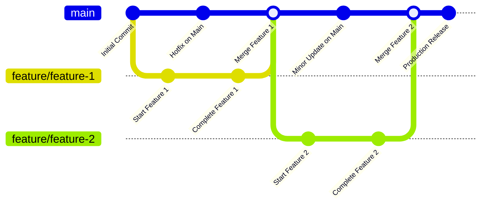

> [!IMPORTANT]  
> ⚠️ Current wiki describes the vision
>
> 

We have core team that works on the project and tasks allocated to the community.

This chapter describe current development vision:

- [design](design.md)

- [clients](clients.md)

- [gateways](gateways.md)

- [servers](servers.md)

- [platform](platform.md)

- [devops](devops.md)

## Trunk-based development

We reject untested code.
Feature flags are used to test new features

Pros:
- Increased velocity
- No one review large PRs
- No long-lived branches

Cons:
- Task should be decomposed
- Can break everything
- Hard to manage feature flags

// Draw a bpmn diagram of task flow involving: business, design, dev, analyst, test, infra/sec

> TODO: fix it



Development task:

| **Definition of Ready (DoR)**                                      | **Definition of Done (DoD)**                                           |
|-------------------------------------------------------------------|-----------------------------------------------------------------------|
| 1. Task created in GH with clear details of what to develop or fix | 1. PR has a clear and detailed description                            |
| 2. Interface designs are prepared and approved                    | 2. Developed functionality matches task requirements and is approved  |
| 3. Task specification is complete and ready for development        | 3. Documentation is included in the pull request                      |
|                                                                   | 4. Fixups commits are cleaned up before merging feature branch        |
|                                                                   | 5. Functionality is tested on the staging environment                 |
|                                                                   | 6. PR has 2 developer, 1 analyst, and 1 QA approval                   |
|                                                                   | 7. Vulnerability scan shows no new issues                             |

## Teamwork processes

Task flow diagram:


<details>

```txt
@startuml task-flow

@enduml
```

</details>

## Task Management Guidelines

Objectives:
- Structure the Jira workspace efficiently
- Improve team understanding of task purposes
- Eliminate duplicate tasks
- Maintain security-first approach in task documentation

Epic Requirements:
- Epic names should correspond to major product features or protocol updates
- Must include detailed description and security considerations
- Should reference related smart contracts or protocols

Story Requirements:

> [!NOTE]
> TODO: refactor

Three types of stories:
1. Product Stories (new features/functionality)
2. Technical Stories (infrastructure/security)
3. Hotfixes (critical patches)

Product Story Requirements:
- Name should reflect user journey/feature
- Must include comprehensive description and scope
- Specify affected components (Wallet, Trading Engine, Smart Contracts, DeFi protocols, etc.)
- Must include these tasks:
  - System Analysis [SA]
  - Security Review [SEC]
  - UI/UX Design [DESIGN]
  - Test Cases [QA]
  - Frontend Development [FRONT]
  - Smart Contract Development [SC]
  - Backend Development [BACK]
  - Database/Chain Integration [DB]
  - Technical Documentation [DOC]
  - Security Testing [SEC-QA]

Technical Story Requirements:
- Can contain specific implementation tasks
- Examples: "Setup Smart Contract Testing Environment [INFRA]", "Implement Gas Optimization [SC]"

## Teamwork processes

Task Requirements:
- Detailed description of requirements and acceptance criteria
- Break down complex tasks into subtasks
- System Analysis tasks must link to technical documentation
- Smart contract development tasks must include security considerations
- Frontend and backend development should be coordinated with documentation

Bug Requirements:
- Detailed description of the issue and its security implications
- Reference to affected story/feature
- Impact assessment (especially for security/financial implications)
- Required tasks for fixes must be created
- Critical security bugs must be flagged for immediate attention

## Collaboration

Example of collaboration in large project (we don't want that):


## Infrastructure-as-code

## Design-as-code

## Docs-as-code

> TODO: describe in C4 model

<details>

```txt
@startuml
!include <https://raw.githubusercontent.com/plantuml-stdlib/C4-PlantUML/master/C4_Container.puml>

Person(user, "User")
System(system, "Marketplace")

Rel(user, system, "Make order")
@enduml

```

</details>
