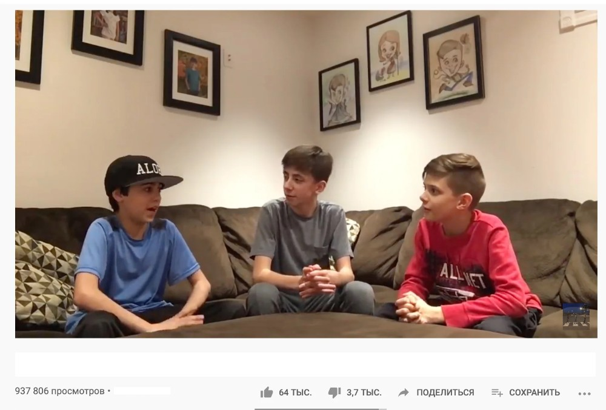

# Endevor

Vision of final product:

Self sustainable (3 components of blockchain agent training)
App for founders and angels to discover and create ideas.
Angels can discover early stage startups with AI
Founders can evaluate ideas with AI
Founders and Angels can evaluate ideas with our AI-agent that train

LLM, founder, and angel talk about startup:

Each block ships new LLM model

## Overview

### Target Audience Analysis

**Experienced Entrepreneurs:** These entrepreneurs typically have prior exits and well-established networks. They collaborate with trusted partners and colleagues, which reduces their need for external platforms. Desert may not add significant value to this audience due to their reliance on existing connections.

**Serious, Moderately Experienced Entrepreneurs:** This audience includes individuals with industry experience but no prior exits. They value trust within cofounding teams and prefer working with individuals they already know. While Desert may provide value, this group often gravitates toward established platforms like YC or AngelList for team-building and resources.

**Amateur Entrepreneurs:** Beginners with minimal business experience may be skeptical of sharing ideas publicly due to fear of theft. This audience is risk-averse and less likely to trust Desert’s collaborative model unless strong safeguards and assurances are in place. Addressing their skepticism through transparency and education will be key to gaining their confidence.
